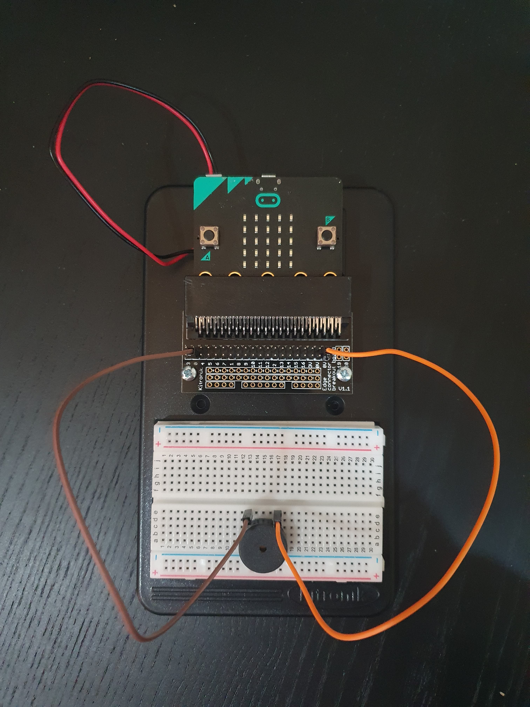
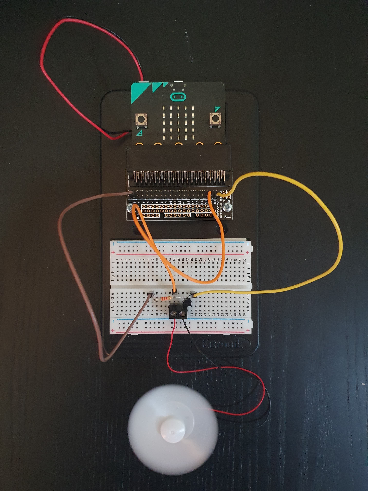
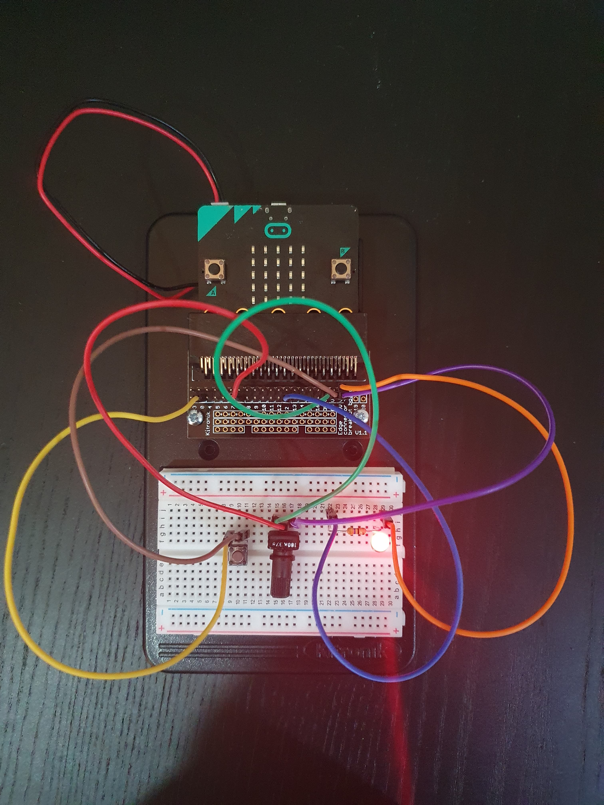
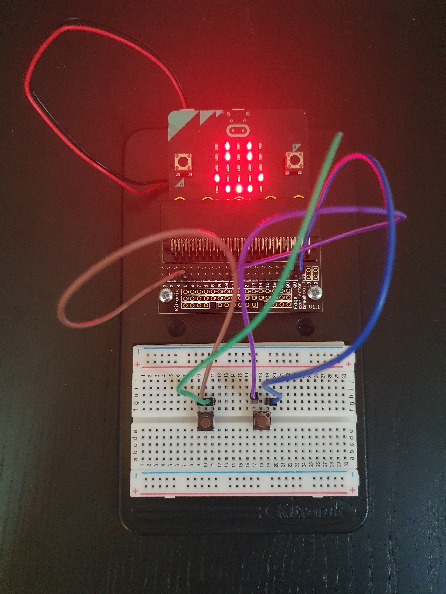

# Inventor Kit Experiments

*Markdown reference: https://guides.github.com/features/mastering-markdown/*

### Experiment name ###

Setting the Tone with A Piezo Buzzer

#### Photo of completed project ####

Buzzer playing melody "dadadum"

#### Reflection ####

In this experiment, something I learned was that by connecting the two wires from the connector board to the corresponding collmn that the buzzer prongs were placed in creates the circuit allowing the buzzer to make sounds.

This experiment could be the basis of a real world application such as traffic light buttons for crossing roads or small battery powered door bells. 

### Experiment name ###

Using A Transistor to Drive A Motor

#### Photo of completed project ####

Fan at max speed climbing down to a stop 

#### Reflection ####

In this experiment, something I learned was that by connecting both motor wires to a terminal connector allows it to be connected to a bread board.

This experiment could be the basis of a real world application such as celling fans in homes or a propeller on a boat engine.

### Experiment name ###

Dimming an LED Using A Potentiometer

#### Photo of completed project ####

LED dimmed to low brightness 

#### Reflection ####

In this experiment, something new to me was the fact that two different switches can affect the same LED at once.

This experiment could be the basis of a real world application such as light switches in houses that dim room lights.

### Experiment name ###

Using the Accelerometer to Control Motor Speed

#### Photo of completed project ####

Micro:bit tilted on tissue box to activate fan movement

#### Reflection ####

In this experiment, something I learned was that depending on how much you tilt the divice you can change how fast the motor spins. For example, if the Micro:bit is fully vertical the motor will be at max speed. 

This experiment could be the basis of a real world application such as segways and other mobility devices.

### Experiment name ###

Say "Hello" to the BBC Micro:bit!

#### Photo of completed project ####

LED grid outputting a smiley face 

#### Reflection ####

In this experiment, something new to me was that the LEDs can be used to display words or sentences by scrolling each letter to the left.

This experiment could be the basis of a real world application such as electronic signs in public transport to tell you the next station.

