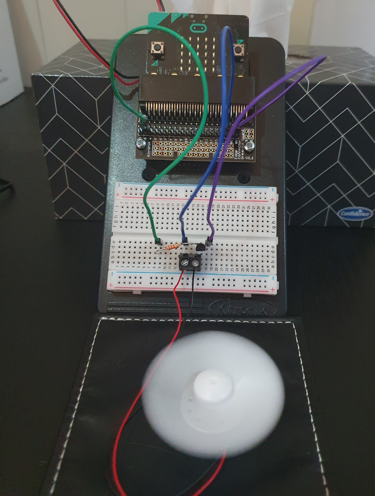

# Inventor Kit Experiments

*Markdown reference: https://guides.github.com/features/mastering-markdown/*

## Instructions ##

*For a selection of 5 inventor kit experiments that you choose, fill out the following sections.

### Experiment name ###

Setting the Tone with A Piezo Buzzer

#### Photo of completed project ####
*In the code below, replace `missingimage.png` with the name of the image, which should be in the `kitexperiments` folder.*

Buzzer playing melody "dadadum"

#### Reflection ####

In this experiment, something new to me was or something I learned was (insert something here).

This experiment could be the basis of a real world application such as (insert something here).

### Experiment name ###

Using A Transistor to Drive A Motor

#### Photo of completed project ####
In the code below, replace imagemissing.jpg with the name of the image, which should be in the kitexperiments folder.

Fan at max speed climbing down to a stop 

#### Reflection ####

In this experiment, something new to me was or something I learned was (insert something here).

This experiment could be the basis of a real world application such as (insert something here).

### Experiment name ###

Dimming an LED Using A Potentiometer

#### Photo of completed project ####
In the code below, replace imagemissing.jpg with the name of the image, which should be in the kitexperiments folder.

LED dimmed to low brightness 

#### Reflection ####

In this experiment, something new to me was or something I learned was (insert something here).

This experiment could be the basis of a real world application such as (insert something here).

### Experiment name ###

Using the Accelerometer to Control Motor Speed

#### Photo of completed project ####
In the code below, replace imagemissing.jpg with the name of the image, which should be in the kitexperiments folder.

Micro:bit tilted on tissue box to activate fan movement

#### Reflection ####

In this experiment, something new to me was or something I learned was (insert something here).

This experiment could be the basis of a real world application such as (insert something here).

### Experiment name ###

Say "Hello" to the BBC Micro:bit!

#### Photo of completed project ####
In the code below, replace imagemissing.jpg with the name of the image, which should be in the kitexperiments folder.

LED grid outputting a smiley face 

#### Reflection ####

In this experiment, something new to me was or something I learned was (insert something here).

This experiment could be the basis of a real world application such as (insert something here).

