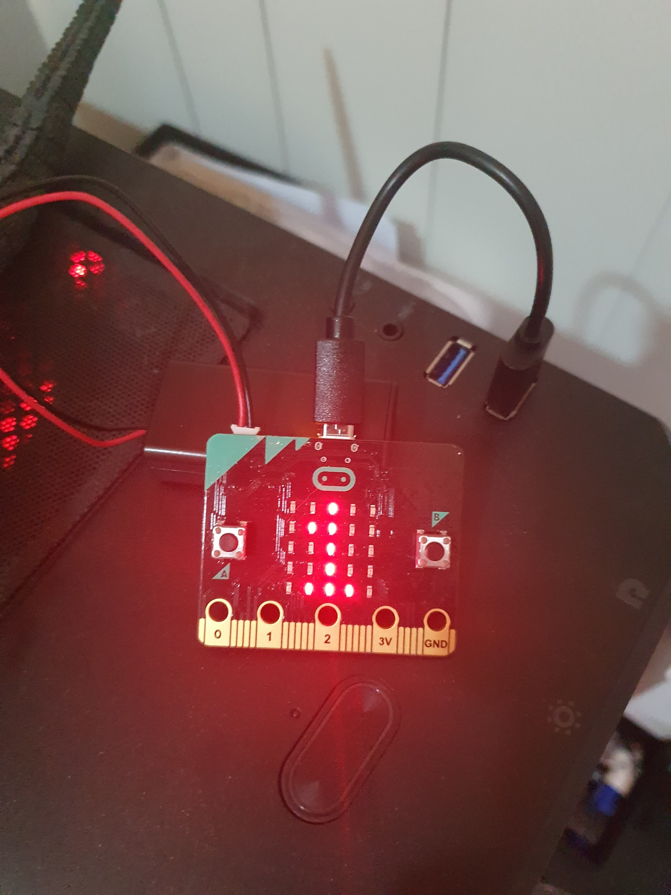
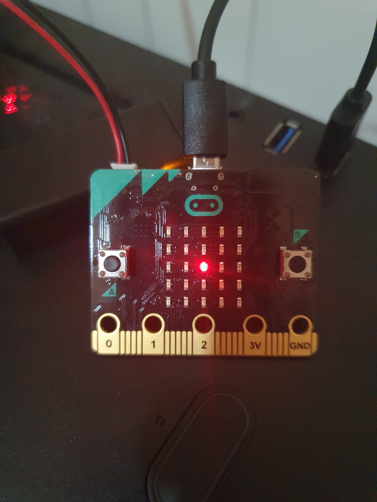
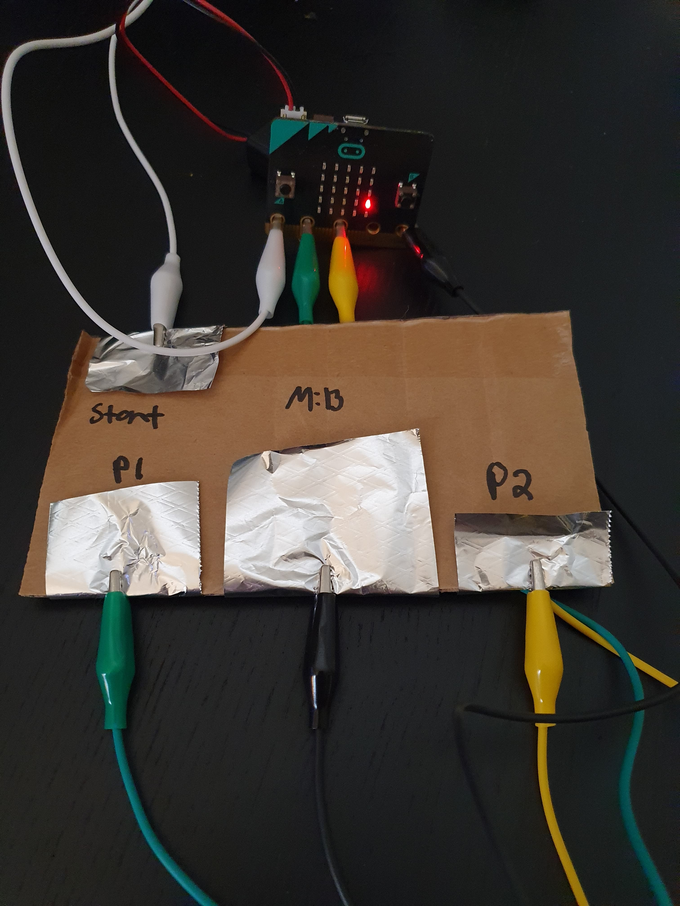
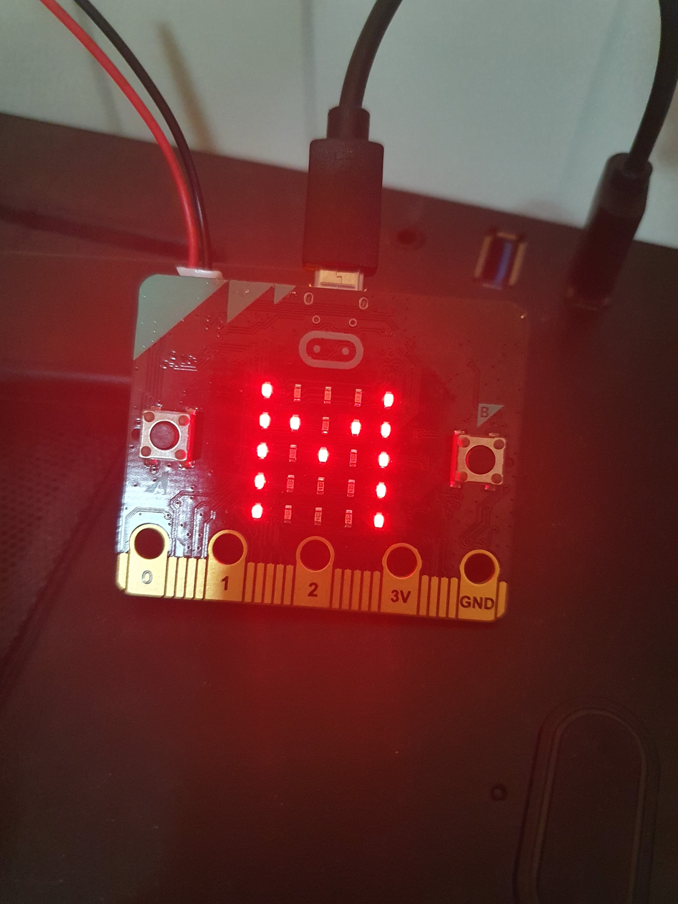
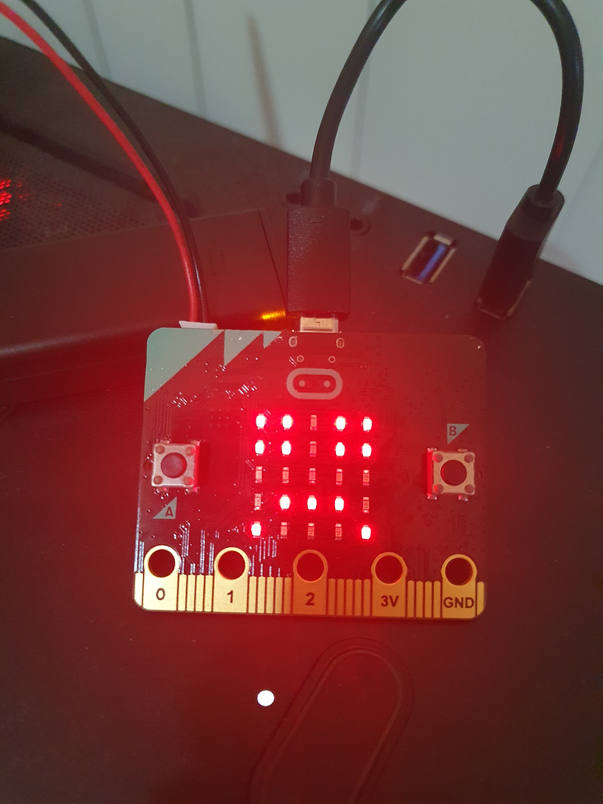
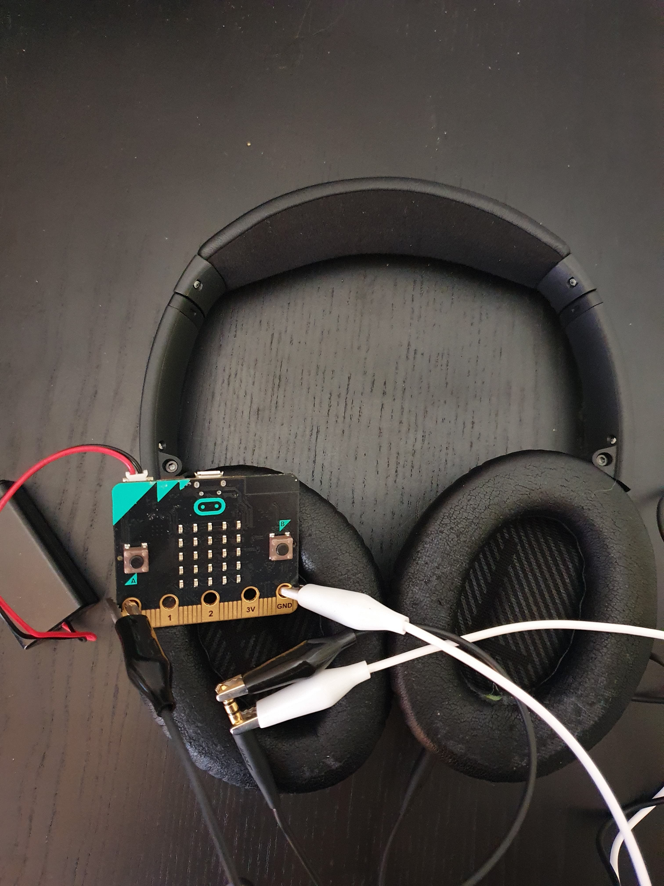
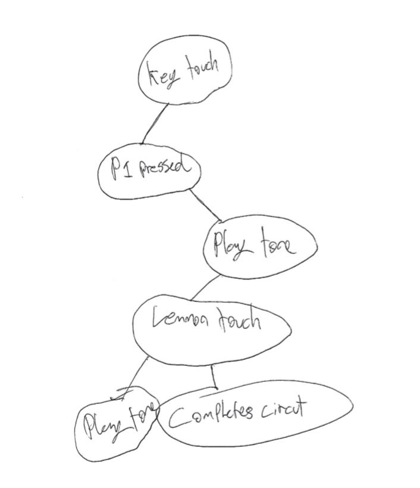
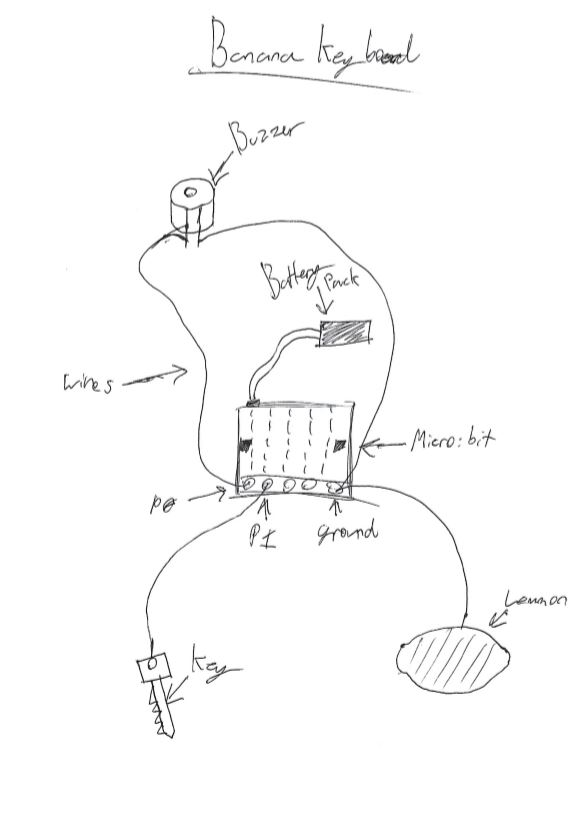
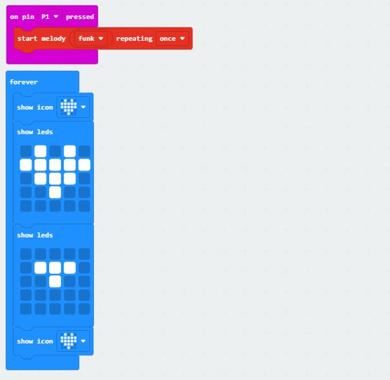

# Assessment 1: Replication project

*Markdown reference:* [https://guides.github.com/features/mastering-markdown/](http://guides.github.com/features/mastering-markdown/)

## Replication project choice ##
Banana Keyboard 

## Related projects ##
*Find about 6 related projects to the project you choose. A project might be related through  function, technology, materials, fabrication, concept, or code. Don't forget to place an image of the related project in the* `replicationproject` *folder and insert the filename in the appropriate places below. Copy the markdown block of code below for each project you are showing, updating the number* `1` *in the subtitle for each.*

### Related project 1 ###
Stopwatch

(https://makecode.microbit.org/projects/stopwatch)

This project is related to mine because it utilizes a button to stop and start the counter.

### Related project 2 ###
Snap the Dot

(https://makecode.microbit.org/projects/snap-the-dot)

This project is related to mine because it utilizes a button by making it a conrol for a game.

### Related project 3 ###
Reaction Time

(https://makecode.microbit.org/projects/reaction-time)

This project is related to mine because it utilizes human connection to complete an action.

### Related project 4 ###
Love Meter

(https://makecode.microbit.org/projects/love-meter)

This project is related to mine because it utilizes the push of a button to obtain the score.

### Related project 5 ###
Smiley Buttons

(https://makecode.microbit.org/projects/smiley-buttons)

This project is related to mine because it utilizes a button to output two different faces.

### Related project 6 ###
Speakers with the Micro:bit

(https://www.youtube.com/watch?v=cxfPNc4Wefo)

This project is related to mine because it utilizes headphones and creates sound

## Reading reflections ##
*Reflective reading is an important part of actually making your reading worthwhile. Don't just read the words to understand what they say: read to see how the ideas in the text fit with and potentially change your existing knowledge and maybe even conceptual frameworks. We assume you can basically figure out what the readings mean, but the more important process is to understand how that changes what you think, particularly in the context of your project.*

### Reading: Don Norman, The Design of Everyday Things, Chapter 1 (The Psychopathology of Everyday Things) ###

*What I thought before: Before reading this I didn't put much thought into how ergonomic a door needs to be.* 

*What I learned: After reading The Design of Everyday Things, I now understand that doors and everyday things CAN be designed poorly and how every little thing matters such as the direction a door handle faces or how no hadle is in some scenarios better.* 

*What I would like to know more about: I would like to know more about what goes into the flow of an area. For example an airport and its terminals. How the furniture and people are placed to make the flow of the environment more efficient. Such as bording the passengers and how fast the line moves due to how efficent the staff and furniture placed.* 

*How this relates to the project I am working on: This relates to the project i'm working on due to the fact that it involves human interaction. Making the project less complicated and removing all unneeded materials is important to improving the ease of use and functionality of the project.*   

### Reading: Chapter 1 of Dan Saffer, Microinteractions: Designing with Details, Chapter 1 ###

*What I thought before: Before reading this I over looked most microinteractions and didn't realize how helpful they are.*

*What I learned: Attention to detail is everything, microinteractions are a great example of that. It's the smaller things in design that make all the difference to the end product. Making tasks easier for the user in every way possible increases your chanses of that user to not only anjoy what they're doing but come back for more.*

*What I would like to know more about: I would like to know how many other microintergrations there are.*  

*How this relates to the project I am working on: This associate with my project because attention to detail helps improve functionality and usability.*

### Reading: Scott Sullivan, Prototyping Interactive Objects ###

*What I thought before: Before reading this I belived programming was harder and less achievable. I also thought I wasn't involved in technology as much as I am.* 

*What I learned: Prototypes are a key step in the development, allowing the designer to test how the solution will work and even show the solution to users for feedback. Also from a business standpoint more often than not if you enjoy the design it's likely consumers will too.*

*What I would like to know more about: I would like to know more about what the fundamentals of programming are and what important pieces of technology from this day and age were prototyped on and arduino.* 

*How this relates to the project I am working on: Prototyping is very important in this project as it will help me fix any mistakes I come across, also it will help me with improvinmg on the project.* 

## Interaction flowchart ##
*Draw a flowchart of the interaction process in your project. Make sure you think about all the stages of interaction step-by-step. Also make sure that you consider actions a user might take that aren't what you intend in an ideal use case. Insert an image of it below. It might just be a photo of a hand-drawn sketch, not a carefully drawn digital diagram. It just needs to be legible.*

## Process documentation

*In this section, include text and images that represent the development of your project including sources you've found (URLs and written references), choices you've made, sketches you've done, iterations completed, materials you've investigated, and code samples. Use the markdown reference for help in formatting the material.*

*This should have quite a lot of information!*

*There will likely by a dozen or so images of the project under construction. The images should help explain why you've made the choices you've made as well as what you have done. Use the code below to include images, and copy it for each image, updating the information for each.*

## Project outcome ##

### Project Name ###
*Banana Keyboard*
### Project description ###

*This project is a Banana Keyboard device that playes a tune depending on what friut is touched with a hand. This project can either be for muscisions or people looking to learn code and electronics through sound experiments. The Banana keyboard can be used for making music and learning electronics.*

### Showcase image ###

*Try to capture the image as if it were in a portfolio, sales material, or project proposal. The project isn't likely to be something that finished, but practice making images that capture the project in that style.*

### Additional view ###

*Provide some other image that gives a viewer a different perspective on the project such as more about how it functions, the project in use, or something else.*

### Reflection ###

*Describe the parts of your project you felt were most successful and the parts that could have done with improvement, whether in terms of outcome, process, or understanding.*

*What techniques, approaches, skills, or information did you find useful from other sources (such as the related projects you identified earlier)?*

*What ideas have you read, heard, or seen that informed your thinking on this project? (Provide references.)*

*What might be an interesting extension of this project? In what other contexts might this project be used?*
